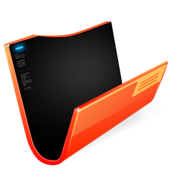

<p align="center"></p>

# File-Manage-System 文件管理系统

## Issues
使用的时候遇到任何问题或有好的建议，请点击进入[issue](https://github.com/hai2007/File-Manage-System/issues)！

> 基于```JDK 1.8```、```Maven 3.8.4```开发。

## 写在这里

> 研发中，敬请期待！

## 如何使用？

打开```eclipse```后，按照下面顺序导入下面：

```
[File] -> [Import] -> [Maven] -> [Existing Maven Projects]
```

然后选择当前项目即可成功导入。

导入后运行只需要把```Main.java```作为入口，选择```run as Application```即可。

此时，服务器就启动了，由于采用了前后端分离开发模式，你还需要启动Web端。

关于Web端，请打开```src/main/webapp/README.md```查看说明。

开源协议
---------------------------------------
[MIT](https://github.com/hai2007/File-Manage-System/blob/master/LICENSE)

Copyright (c) 2022 [hai2007](https://hai2007.gitee.io/sweethome/) 走一步，再走一步。
